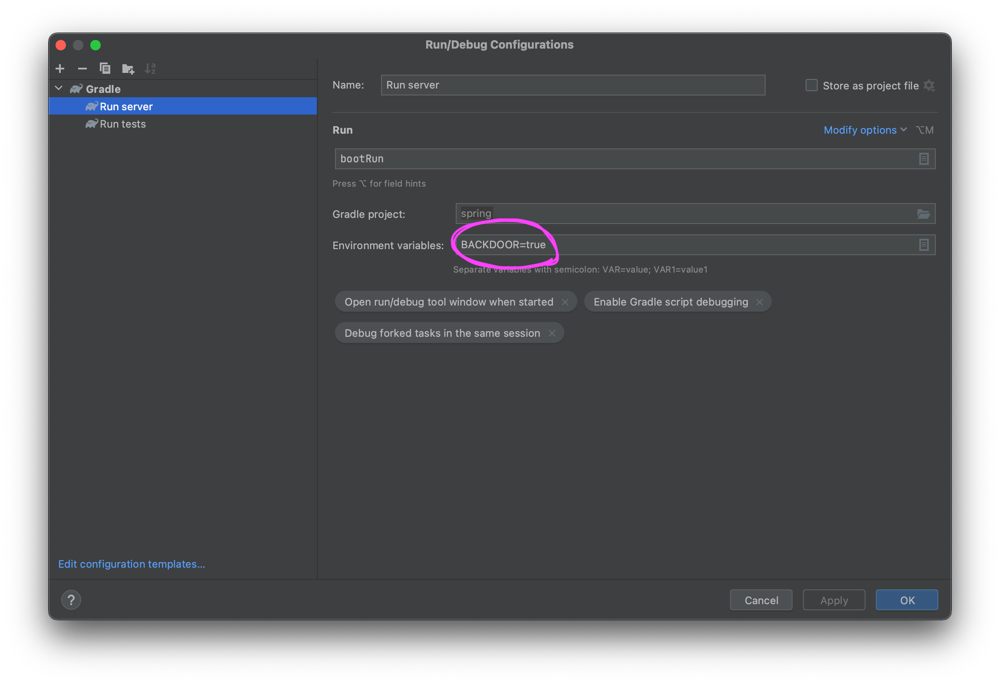

# Backdoor API 컨트롤 예제

## Backdoor 활성화

환경변수 `BACKDOOR` 설정해서 서버 실행.

```bash
BACKDOOR=true ./gradlew bootRun
```

cURL로 확인했을 때 “OK”란 응답이 나오면 잘 되고 있는 겁니다.

```bash
curl localhost:8080/backdoor/setup-database
```

## Backdoor 비활성화

환경변수 `BACKDOOR`를 건드리지 않음.

```bash
./gradlew bootRun
```

cURL로 확인했을 때 아무런 텍스트도 보이지 않는다면 잘 막힌 겁니다.

```bash
curl localhost:8080/backdoor/setup-database
```

## IntelliJ IDEA에서 세팅


